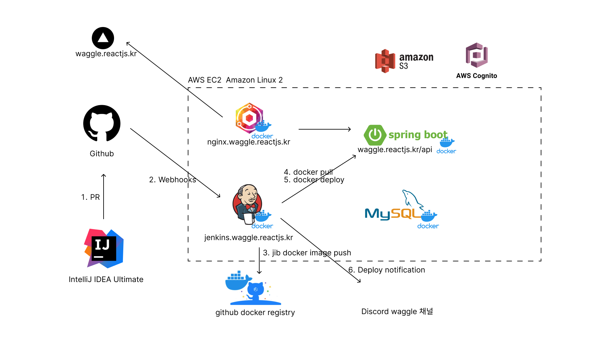
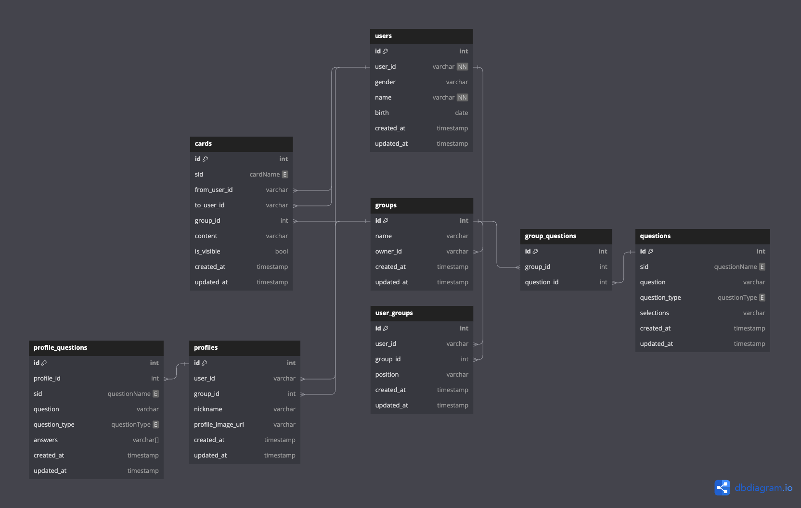

# 와글(waggle)
와글은 동아리, 동호회, 스타트업, 학교, 커뮤니티 등에서 사용할 수 있는 카드 기반의 소셜 네트워크 자기소개 서비스입니다.


* 사이트 : https://waggle.reactjs.kr/
* API : https://waggle.reactjs.kr/api 
* 스웨거 : https://waggle.reactjs.kr/api/swagger-ui/index.html


## 요구 사항
* JDK 17

## 실행 방법


```sh
# vi /etc/hosts
127.0.0.1       ddd.com api.ddd.com db.ddd.com soan.ddd.com jenkins.ddd.com

# cli
docker-compose up -d
```
http://localhost:81 에서 잘 하셈

## 개발 환경 설정

아래 방법을 통해 개발에 필요한 DB, Redis, phpMyAdmin을 실행할 수 있다.
phpMyAdmin은 http://localhost:8888 에서 접속할 수 있으며, MySQL을 웹에서 관리할 수 있다.

API 는 IntelliJ IDEA 에서 실행하면 된다.
```sh
docker network create ddd-network

docker run -d \
  --name ddd-mysql \
  --network ddd-network \
  -p 3306:3306 \
  --restart always \
  -e MYSQL_DATABASE=default \
  -e MYSQL_ROOT_PASSWORD=password \
  -e MYSQL_USER=admin \
  -e MYSQL_PASSWORD=password \
  mysql:8.2 --default-authentication-plugin=mysql_native_password
  
docker run -d \
  --name ddd-phpmyadmin \
  --network ddd-network \
  --restart always \
  -e PMA_ARBITRARY=1 \
  -e PMA_HOST=ddd-mysql \
  -p 8888:80 \
  phpmyadmin

docker run -d \
  --name ddd-redis \
  --network ddd-network \
  --restart always \
  redis:7.2-alpine
```

로컬 개발환경에서는 application.yml 을 사용하게 되며 환경변수에는 ENCRYPTOR_PASSWORD=secret 이 필요하다.

또는 인텔리제이에서 실행할 때, environment variables 에 ENCRYPTOR_PASSWORD=secret 를 추가하면 된다.
```sh
$ env 
...
ENCRYPTOR_PASSWORD=secret
...
```

## MVP

<details><summary>Phase 0</summary><pre markdown="1">
- 타켓(동아리/동호회)
- 기능
    - 기본 제공 카드를 주거나, 받을 수 있음
    - 기본 자기소개를 완성할 수 있음
    - 카드에 메시지를 추가할 수 있음
    - 초대 링크로 팀원을 초대할 수 있음
</pre></details>

<details><summary>Phase 1</summary><pre markdown="1">
- 타켓(동아리/동호회)
- 기능
    - 소셜 로그인
    - 조직별 자기소개 템플릿 설정
    - 카드 비공개, 공개 모드를 설정할 수 있음
    - 사용자는 카드를 롤링페이퍼 형식으로 볼 수있음 
    - 이메일로 팀원을 초대할 수 있음
</pre></details>

<details><summary>Phase 2</summary><pre markdown="1">
- 타켓(동아리/동호회, 스타트업)
- 기능
    - 기본 제공 카드, 조직 커스텀 카드를 주거나, 받을 수 있음
    - 관리자는 조직의 커스텀 카드를 생성할 수 있음
    - 조직별 분석 제공 (가장 많은 카드를 보낸 사람, 가장 많은 칭찬 카드를 받은 사람 ..)
    - 관리자는 미션을 만들 수 있음 (0일 뒤 00의 생일이에요! 생일 축하 카드를 보내보아요! 등)
</pre></details>

<details><summary>Phase 3</summary><pre markdown="1">
- 타켓(동아리/동호회, 스타트업, 학교, 커뮤니티)
- 기능
    - 기본 제공 카드, 조직 커스텀 카드, 사용자 커스텀 카드를 주거나, 받을 수 있음
    - 관리자는 조직의 커스텀 카드를 생성할 수 있음
    - 사용자는 조직의 커스텀 카드를 생성할 수 있음
    - 사용자별 인공지능 요약 제공 (사람들이 말한 바에 따르면, 당신은 00한 사람이군요!)
</pre></details>

## 인프라



## ERD

